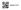
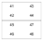
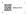

# ASN labels for Paperless-ngx on Avery labels 

The [recommended workflow](https://docs.paperless-ngx.com/usage/#usage-recommended-workflow) of [Paperless-ngx](https://docs.paperless-ngx.com/) uses QR codes for ASN (archive serial number) labels.



This script helps creating them using Python. It outputs a PDF for printing on the label sheets. Make sure to set print size to 100%, not _fit to page_ or similar.

Other Avery (or competitor's) label sizes can be added to `labelInfo` in `AveryLabels.py`. All other settings are configured at the top part of `main.py`.

Use these settings for an initial position test to align your printer:

```python
mode = "text"
debug = True

labelsAlreadyPrinted = 0
labelsCorrupted = 0
labelsToPrint = 1

positionHelper = True
```

## Settings

Configurations available in `main.py`:

* `labelForm`: Select your label sheet version from the `labelInfo` list in `AveryLabels.py`.
* `mode`:
  * `qr`: Print a QR code and a text next to it showing the ASN.
  * `text`: Print a free text on the label.
* `text`: The free text used for `mode = text`.
* `subLabelsX`/`subLabelsX`: Print multiple labels on a single cutout of a label sheet.
                             This is helpful for small label sizes even though your physical label cutout sizes are bigger.
                             Use a steel ruler and a sharp box cutter knife after printing to split up the labels.
* `firstASNOnSheet`: The first ASN number that is/has been printed on the current sheet. Set to `1` on your initial sheet.
* `labelsAlreadyPrinted`: If you have already printed a some labels on the current sheet, use this to skip overwriting them.
* `labelsCorrupted`: Due to misprints or other reason, some labels on the current sheet might have gotten corrupted. This skips the unusable labels.
* `labelsToPrint`: How many labels you want to print now.

More settings:
* `debug`: For initial calibration, a solid border line will be printed that should line up with the cutouts on your sheet. In `mode = text`, label text will be ascending numbers.

  

* `positionHelper`: Small dots will be printed in the corner of (sub-)labels. Useful  as subtle sublabel cutting guides.

  

# Credits

This is based on the [work from timrprobocom](https://gist.github.com/timrprobocom/3946aca8ab75df8267bbf892a427a1b7)